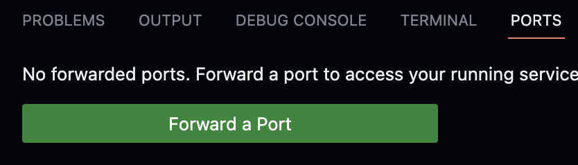
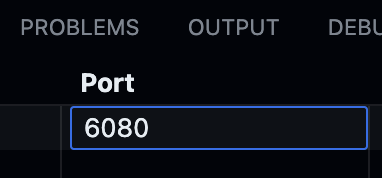
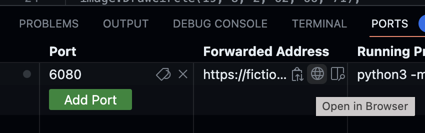
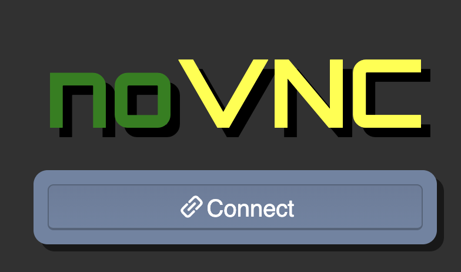
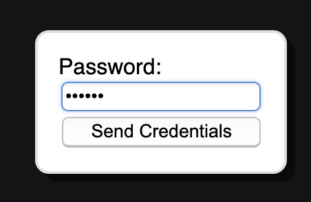

#  Friendly Robot Class

  

You will create a ``Robot`` class which will be able to draw a little robot icon at a particular place on the screen.

Your robot will alternate drawing from two possible icons to create a small animation.

We've provided ``main.cc`` that uses your ``Robot`` class to draw an animated robot that follows your cursor around.

   
  
  

You will be implementing four member functions we've declared for you in the ``Robot`` class in `robot.h`.

``Robot`` needs a constructor, and getter and setter functions (aka accessors and mutators) for pixel location.

  

##  Constructor

We've declared the constructor in `robot.h`:  
```cpp
Robot(const std::string& filename1, const std::string& filename2);
```

You must implement the ``Robot`` Class constructor in `robot.cc`. It takes two string parameters, the filename for the robot icon to show first, and the filename for the robot icon to show second. Your constructor should save these filenames in the `filename1_` and `filename2_` member variables but should not construct the images yet.

*Why not load the images in the constructor? It's not good practice to do [work in constructors](https://google.github.io/styleguide/cppguide.html#Doing_Work_in_Constructors) because if there is an error it leaves the program in a bad state.*

**Don't forget: when you implement a member function, you must specify the class name before the function name, so the compiler knows that the function is a member of the class e.g.:**
```cpp
int MyClassName::MyFunctionName() {
	...
}
```


##  Accessors (Getter) Functions

  We declared the accessors (getter) functions for you in `robot.h`:
```cpp
int GetX();
int GetY();
```

The ``Robot`` class tracks its (x, y) pixel location with two private integer member variables. It must provide public accessor functions for x and y, ``GetX()`` and ``GetY()`` which both return ``int``s.  Implement these accessor functions in `robot.cc`, following the appropriate syntax for member function definitions (don't forget the class name!)

##  Mutator (Setter) Function

To set the (x, y) location, ``Robot`` provides a public function ``SetPosition`` which takes two arguments, the ``int`` x position and ``int`` y position.

```cpp
void SetPosition(int x,  int y);
```
Implement this mutator function in `robot.cc` , following the appropriate syntax for member function definitions (don't forget the class name!)

  

##  How the Robot icon is Drawn

 If you're curious how the Robot icon is drawn on the screen: 

``Robot`` must implement a function, ``Draw``, that takes a reference to a ``graphics::Image``, and draws the robot icon on that image.

  

The ``Draw`` function will be called repeatedly by ``main.cc``. Each time ``Draw`` is called ``Robot`` should draw an icon centered at (x, y). ``Robot`` must alternate which icon is drawn from the the two filenames in the constructor: The first time ``Draw`` is called it shows the first icon, and the second time the second icon, etc. The ``Draw`` function loads the image assets passed in the filenames that you should have stored in the constructor. ``Draw`` uses this method from ``graphics::Image``:

```cpp
/*
* Loads an image from a file. Returns false if the image could
* not be loaded. Note: this clears any current state, including
* pixel values, width and height.
*/

bool  Load(const std::string& filename);
```

  

For example,

```cpp
graphics::Image my_image;
my_image.Load("filename.bmp");

```

Second, to draw the icon onto the big image, the ``Draw`` function copies the pixels from the active icon into the ``graphics::Image`` reference that was passed as a parameter. The icon is be centered at the (x, y) position stored in ``Robot``'s private member variables.
  

##  Run your program and play with the friendly robot!
We've provided some robot icons, but feel free to add your own. You can check `main.cc` for a helper function we wrote for you so you can make your own icons programmatically. You can also import your own  icons.

You can use ``robot1.bmp``, ``robot2.bmp``, ``robot3.bmp``, and ``robot4.bmp``. 

   

Here is an example of how you might run the program:

```
root@codespaces-af2ddf:/workspaces/lab-06/prob01# ./main
Enter a filename for the robot icon: robot1.bmp
Enter another filename for the robot icon: robot2.bmp
```

If you are using an Ubuntu machine, you should see a new window open showing the animation. Try moving around your mouse!

### GitHub Codespaces
If you are running code on GitHub Codespaces, there are some additional steps you need to do.

1. Click on the **Ports** tab and click on the green **Forward a Port** button.</br>
</br>
1. Type in **6080** and press enter.</br>
</br>
1. You will see a row showing 6080 for the Port value. Move your mouse close to the URL under **Forwarded Address**. A small globe icon should appear that is for opening the URL in a browser window. Click on the globe icon.</br>
<br/>
1. A new window will open up showing the NoVNC logo. Click on the **Connect** button and use `vscode` as the credentials.</br>
 </br>
1. A window should pop up showing the graphical interface. Take note that if you were running the program on an Ubuntu machine, the experience would be seamless as it should have opened up a window automatically. That is just one advantage of using a bare-metal Ubuntu installation. 

  ## Code Evaluation

Use the `make build` command to compile your code and save it into an executable file called `main`.
Then you can use the `./` command to run it. Take note that if you make any changes to your code, you will need to compile it first before you see changes when running it.

```
make build
./main
```

Alternatively, you can use the `clang++` command to compile your code and the `./` command to run it. 
The sample code below shows how you would compile code in `minimum.cc` and `main.cc`, and into the executable file `main`. 

```
clang++ -std=c++17 main.cc robot.cc cpputils/graphics/image.cc -o main -lm -lX11 -lpthread
```


## Run the unit tests

We've provided unit tests, which you can try with ``make test``. Use the output to help you debug any issues in your program.
For code style, make sure you follow advice from the stylechecker using ``make stylecheck``.
For code formatting, make sure you follow advice from the formatchecker to improve code readbility using ``make formatcheck``.

# Submission
1. When everything runs correctly,  let's copy your code into the Github repository. The first step is to add your code to what is called the staging area using git's `add` command. The parameter after `add` is the name of the file you want to add. There are cases when you have multiple changed files, so you can just type `git add .` (period) to add all modified files.

    ```
    git add robot.cc
    ```
1. Once everything is in the staging area, we use the `commit` command to tell git that we have added everything we need into the staging area.

    ```
    git commit -m "Your description here"
    ```
1. In case it asks you  to configure global variables for an email and name, just copy the commands it provides then replace the dummy text with your email and Github username.

    ```
    git config --global user.email "tuffy@csu.fullerton.edu"
    git config --global user.name "Tuffy Titan"
    ```
    When you're done, make sure you type the `git commit -m "Your description here"` command again.    
1. Lets push all changes to the Github repository using git's `push` command. Provide your Github username and personal access token when you are asked.

    ```
    git push
    ```
1. Once you push, the autograder is automatically kicked off. Check the results in the 'Actions' tab - a green check means that all tests passed.
